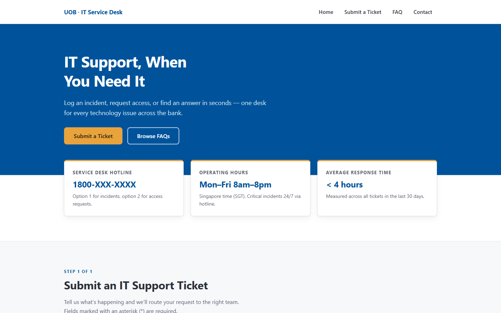
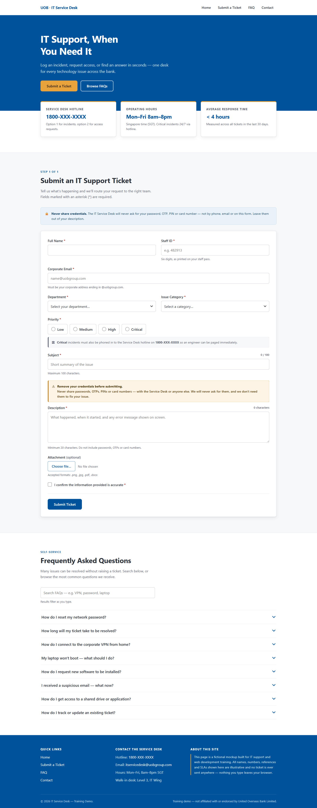

# IT Support Service Desk — Training Demo

**Live demo: <https://alfredang.github.io/itsupport/>**

A single-page internal IT Service Desk portal: ticket submission with full client-side
validation, a searchable FAQ accordion, and a mock ticket-reference generator. Built as a
teaching example of accessible, dependency-free front-end work.



<details>
<summary>Full page — ticket form, credential guard and FAQ accordion</summary>



</details>

> **Training demo — not affiliated with or endorsed by United Overseas Bank Limited.**
> Every name, hotline, email address, SLA and ticket reference on this page is fictional.
> Nothing is submitted anywhere: there is no backend, no analytics and no network request
> of any kind. Do not enter real personal data into it.

## Running it

There is no build step, no package manager and no dependencies. Open the file:

```bash
start index.html      # Windows
open index.html       # macOS
xdg-open index.html   # Linux
```

It is designed to work correctly straight from `file://` — if it ever needs a web server,
something has been added that shouldn't have been.

## What's in it

One file, `index.html` (~1,070 lines): markup, a `<style>` block and a `<script>` block,
divided by `SECTION` marker comments that use matching numbering across all three.

- **Ticket form** — nine fields with per-field validation on blur and on submit, inline
  errors, `aria-invalid`, and focus sent to the first invalid field. On success it
  generates a reference of the form `UOB-ITSD-YYYYMMDD-####` and shows the SLA for the
  chosen priority.
- **Credential guard** — the description field is scanned for anything resembling a
  password, OTP, PIN or card number, and warns the user rather than accepting it. The
  form deliberately collects no credentials of any kind.
- **FAQ** — eight accordion items, one open at a time, with live keyword search over both
  questions and answers and a no-results state.

## Design constraints

These are the exercise, not incidental details. Changes that break them defeat the point:

| Constraint | Why |
| --- | --- |
| One self-contained file | Must run by double-clicking, with no build step or server |
| No `localStorage` / `sessionStorage` | Submitted tickets live in an in-memory array and are intentionally lost on reload |
| No `fetch` / `XMLHttpRequest` | Nothing the user types may leave the browser |
| No external assets | Icons are inline SVG; the select chevron is a `data:` URI |
| No credential collection | And the description field actively warns against pasting one |
| Footer disclaimer stays visible | It is what makes the bank branding acceptable |

Verify the first four at any time:

```bash
grep -inE "localStorage|sessionStorage|fetch\(|XMLHttpRequest|https?://" index.html \
  | grep -v "www.w3.org/2000/svg"
```

The only expected match is the source comment that names them.

## Conventions worth knowing before editing

- **Adding a form field takes three matching pieces**: an entry in the `validators` object
  keyed by the input's `id`, an empty `<p class="error" id="<id>-error">` in the markup, and
  `aria-describedby="<id>-error"` on the control. The registry drives validation, submission,
  error clearing and reset — miss a piece and the field is silently skipped.
- **Colours come from `:root` custom properties.** Change the token, not the call site. The
  gold accent is for borders and fills only; it fails AA contrast as small text on white.
- **Focus rings are never removed**, only restyled through `:focus-visible`.
- **The credential regexes are deliberately tuned** to ignore "my password is not working"
  and "the password reset link" — the two most common real service-desk phrasings. Loosening
  them reintroduces constant false positives.
- **The SLA table appears twice** — in the `SLA` object and in prose in FAQ item 2. Update both.

## Testing

There is no test framework. The script is wrapped in an IIFE and touches the DOM, so it
cannot be imported; to exercise the pure logic, slice it out of the source and evaluate it,
which tests the real shipped code rather than a copy:

```bash
node -e "
const src=require('fs').readFileSync('index.html','utf8').split('<script>')[1];
const grab=(s,e)=>{const a=src.indexOf(s);return src.slice(a,src.indexOf(e,a));};
eval(grab('var CRED_WORD','function scanCredentials'));
eval(grab('function scanCredentials','var credState'));
console.log(scanCredentials('my password is hunter2').flagged);   // true
console.log(scanCredentials('the password reset link').flagged);  // false
"
```

The same approach works for `validators`, `makeReference` and the `SLA` map.

`CLAUDE.md` holds the fuller architecture notes.

## Deployment

Pushing to `main` triggers `.github/workflows/pages.yml`, which publishes the repository
root to GitHub Pages. There is nothing to build, so the workflow uploads the root directly.
